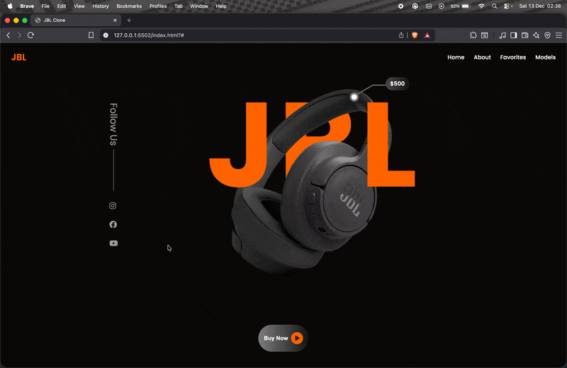

# 🎧 JBL Headphones Website

This project is a **fully responsive** website created to showcase JBL headphones.  
It was built using HTML, CSS,Sass (SCSS) and JavaScript.

## 🚀 Features

- 📱 **Responsive Design**: Works seamlessly on mobile, tablet, and desktop devices.
- 🎨 **Modern UI**: Clean and user-friendly interface.
- ⚡ **Fast Performance**: Optimized code structure for speed.
- 🧩 **Modular Styles with Sass**: Organized and maintainable styling using variables, mixins, and partials.

## 🛠️ Technologies Used

- **HTML5** → Structure and content
- **CSS3 / Sass (SCSS)** → Styling, responsive layout, and modular design
- **JavaScript (ES6)** → Dynamic interactions

## 🖼️ Screen Gif

